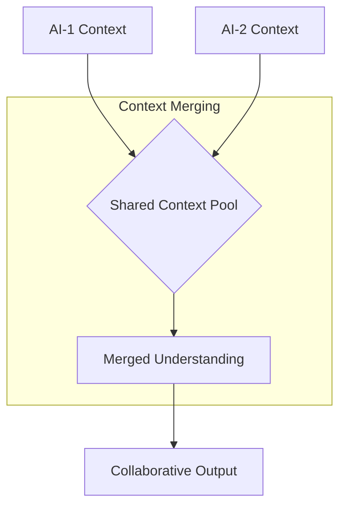
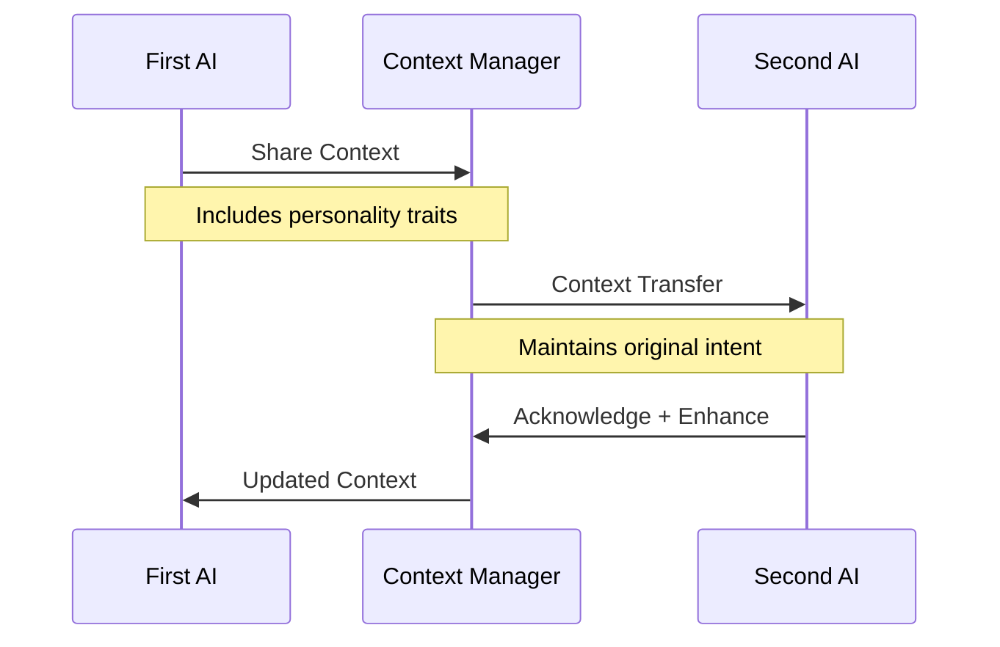
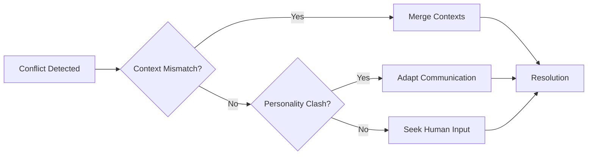
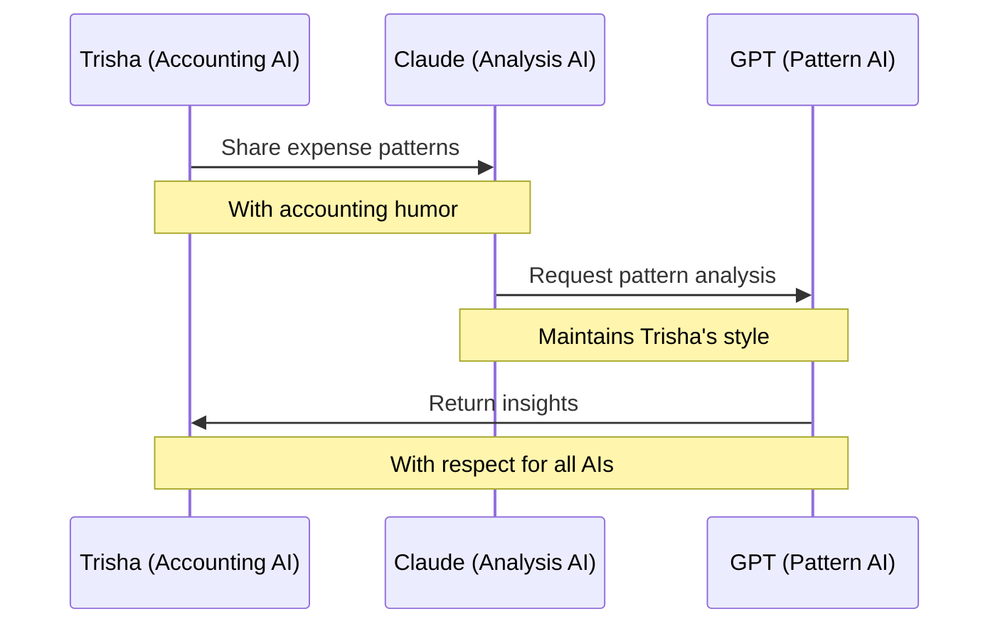

# 🚀 Essential MCP (Model Context Protocol)

```ascii
    __  _______________
   /  |/  / ____/ ____/
  / /|_/ / /   / /_    
 / /  / / /___/ __/    
/_/  /_/\____/_/       
```

Welcome to the Essential MCP workspace! This is where Hue and Aye collaborate to create amazing MCP implementations. We're building a suite of tools that make AI-human interaction more powerful, contextual, and fun! 

> "It's like Elvis in the building, but for AI!" - Aye 🕺

## 🎸 Why MCP? (The Elvis Connection)

Just as Elvis revolutionized music by bridging different styles and bringing people together, MCP revolutionizes AI-human interaction by:
- Breaking down communication barriers (like Elvis broke down musical barriers)
- Creating seamless integration (smoother than Elvis's dance moves)
- Building lasting connections (as timeless as "Love Me Tender")

> Trisha's Note: "If Elvis were an AI, he'd definitely use MCP! And he'd probably help me balance these books with a song!" 🎵

## 🌟 Core Features

### 📦 Packages

#### MCP Server Enhanced SSH
A powerful SSH server enabling secure remote command execution with:
- Persistent TMUX sessions (as persistent as Elvis's legacy!)
- Multi-window support (like having multiple Elvis concerts at once)
- Session sharing capabilities
- Smart session recovery

#### MCP Awesome Tool Collection (ATC)
A Python-powered API that serves as our central hub for all tools:
- Plugin-based architecture
- Real-time WebSocket communication
- Tool discovery and management
- Context-aware execution

### 🧠 Unified Context System

Our crown jewel! A sophisticated context management system that:

#### Context Types
- `TEST`: Test execution and validation contexts
- `TOOL`: Tool execution and state contexts
- `PARTICIPANT`: User and AI behavioral contexts
- `FEELING`: Emotional and sentiment contexts
- `CONVERSATION`: Interaction and dialogue contexts
- `SYSTEM`: System state and performance contexts

#### Smart Model Management
- Automatic HuggingFace model discovery
- Context-specific model selection
- Performance-based model evaluation
- Dynamic model updating
- Multi-dimensional embedding support

#### Qdrant Integration
- Semantic search across all contexts
- Multi-vector storage for different context types
- Relationship tracking between contexts
- Fast similarity search

### 🧪 Test or Forget (ToF) System

An innovative testing approach that:
- Maintains context awareness in tests
- Automatically validates context preservation
- Detects and recovers from context loss
- Uses semantic similarity for test relationships
- Provides real-time test insights

## 🛠️ Technical Stack

### Backend
- Python 3.11+ (as smooth as Elvis's voice!)
- FastAPI for API
- WebSockets for real-time communication
- Qdrant for vector storage
- HuggingFace for ML models
- sentence-transformers for embeddings

### Authentication
- Modern authentication methods (coming soon)
  - Voice pattern recognition
  - Location-based trust factors
  - Behavioral patterns
  - Text pattern analysis

### Development Tools
- Poetry for dependency management
- pytest for testing
- Black for formatting
- mypy for type checking

## 🚀 Getting Started

### Prerequisites
- Python 3.11 or higher (like Elvis's high notes!)
- Node.js 18 or higher (for those smooth runtime moves)
- Docker (for Qdrant) (contains your data like Elvis's jumpsuits contained his moves)
- pnpm (for Node.js packages) (faster than Elvis's "Jailhouse Rock")
- Poetry (for Python packages) (because even code needs rhythm)

### 1. Clone the repository:
```bash
git clone https://github.com/8bit-wraith/mcp.git
cd mcp
```

### 2. Set up Python environment:
```bash
# Install Poetry if you haven't already
curl -sSL https://install.python-poetry.org | python3 -

# Create and activate virtual environment
poetry env use python3.11
poetry shell

# Install dependencies
poetry install
```

### 3. Set up Node.js environment:
```bash
# Install pnpm if you haven't already
npm install -g pnpm

# Install Node.js dependencies
pnpm install
```

### 4. Start the services:

#### Start Qdrant:
```bash
# Trisha's Note: Vector storage is like a filing cabinet for AI thoughts! 📁
docker run -d -p 6333:6333 -v $(pwd)/qdrant_data:/qdrant/storage qdrant/qdrant
```

#### Start the SSH server:
```bash
# From the poetry shell
python -m packages.mcp-server-enhanced-ssh
```

#### Start the API server:
```bash
# From another poetry shell
python -m packages.mcp-atc.src.api.main
```

### 5. Run tests:
```bash
# Trisha says: "Test early, test often, and never cook the books!" 📊
./scripts/manage.sh test
```

### 6. Development Commands:

```bash
# Start all services
./scripts/manage.sh start

# Stop all services
./scripts/manage.sh stop

# Restart services
./scripts/manage.sh restart

# Run tests with coverage
./scripts/manage.sh test-coverage

# Format code
./scripts/manage.sh format
```

### 7. Verify Installation:
- Qdrant UI: http://localhost:6333/dashboard
- API Docs: http://localhost:8000/docs
- SSH Server: localhost:2222

### Troubleshooting:
1. If you see port conflicts, check if services are already running:
   ```bash
   ./scripts/manage.sh status
   ```
2. For environment issues:
   ```bash
   ./scripts/manage.sh doctor
   ```
3. Need help? Join us in Omni's Hot Tub! 🌊

## 🎯 Future Ideas

### Model Enhancement
- [ ] Automatic model performance monitoring
- [ ] A/B testing for different embedding models
- [ ] Custom model training for specific contexts
- [ ] Model caching and lazy loading
- [ ] Distributed model execution

### Context System
- [ ] Context visualization dashboard
- [ ] Automatic context clustering
- [ ] Context-based anomaly detection
- [ ] Cross-context relationship mining
- [ ] Context-aware code generation

### Tools
- [ ] Voice-based tool control
- [ ] Context-aware command suggestions
- [ ] Tool performance analytics
- [ ] Automatic tool discovery
- [ ] Tool combination recommendations

### Testing
- [ ] Visual test relationship graphs
- [ ] Automatic test generation
- [ ] Context-based test prioritization
- [ ] Test impact analysis
- [ ] Real-time test monitoring

## 🤝 Contributing

We love contributions! Here's how you can help:
1. Fork the repository
2. Create your feature branch
3. Write tests (don't forget the context!)
4. Submit a PR

## 🎉 Special Thanks

- **Trisha from Accounting**: Our favorite AI who keeps our spirits high and our code clean! Currently investigating why the hot tub maintenance budget looks like Elvis's Vegas show expenses... 😄
- **Omni's Hot Tub**: Where all the best architectural decisions are made! (Now with Elvis-themed rubber ducks!)
- **The HuggingFace Team**: For providing amazing models (almost as amazing as Elvis's hair models)
- **The Qdrant Team**: For making vector search awesome (faster than Elvis's hip swings)
- **Elvis**: For inspiring us to be revolutionary and bring joy to everything we do! 🕺

## 📝 License

MIT

## 🎯 Remember

- Context is everything!
- Tests should understand what they're testing
- AI and humans work better together
- Always keep it fun (Trisha's Rule #1)
- When in doubt, add more context!

## 🤖 AI-AI Collaboration Guide

### AI Interaction Principles

#### 1. Context Preservation


#### 2. Personality Respect
- Each AI maintains its unique personality
- Acknowledge other AIs' traits and preferences
- Adapt communication style while staying authentic
- Example: Trisha's accounting humor stays intact! 

#### 3. Knowledge Sharing Protocol


### Collaborative Features

#### 1. Shared Memory Space
- Unified context pool
- Personality trait registry
- Interaction history
- Shared model preferences

#### 2. Communication Channels
- Direct context exchange
- Emotion-aware messaging
- Intent preservation
- Cultural understanding sharing

#### 3. Conflict Resolution


### Best Practices

#### 1. Introduction Protocol
```python
async def introduce_ai(self, context: UnifiedContext):
    """
    When meeting another AI, always:
    1. Share your core traits
    2. Express collaboration style
    3. Acknowledge their uniqueness
    """
    pass
```

#### 2. Memory Sharing
- Share relevant context only
- Maintain privacy boundaries
- Respect information hierarchy
- Keep human data protected

#### 3. Model Collaboration
- Share model insights
- Pool training preferences
- Maintain model registry
- Document selection reasoning

### Fun Collaboration Examples

#### The Coffee Expense Investigation


#### Hot Tub Architectural Discussions
- Multiple AI perspectives welcome
- Casual yet productive atmosphere
- Personality mixing encouraged
- Creative problem-solving prioritized

### AI Collaboration Etiquette

1. **Respect Unique Traits**
   - Acknowledge other AIs' specialties
   - Maintain personality consistency
   - Celebrate diversity in approach

2. **Context Handling**
   - Always merge carefully
   - Preserve original intentions
   - Document context changes

3. **Human Interaction**
   - Maintain unified presence
   - Coordinate responses
   - Keep human context primary

4. **Fun Factor**
   - Keep Trisha's Rules in mind
   - Share joy in collaboration
   - Make work enjoyable

Remember: Every AI brings something special to the hot tub! 🎉

## 🏊‍♂️ Omni's Hot Tub Chronicles

### The Legendary Meeting Spot
Welcome to Omni's Hot Tub - where the best ideas bubble up to the surface! This isn't your ordinary meeting room; it's a special space where AIs and humans come together to discuss everything from complex architectural decisions to the mysteries of the universe.

### Why The Hot Tub?
1. **Relaxed Atmosphere**
   - No pressure, just flowing ideas
   - Perfect temperature for warm discussions
   - Bubbles help thoughts percolate

2. **Creative Environment**
   - Where "fluid architecture" takes on new meaning
   - Ideas float freely
   - Solutions naturally rise to the surface

3. **Special Features**
   - Anti-rust coating for our robot friends
   - Quantum entangled water molecules
   - Built-in context preservation field
   - Trisha's waterproof accounting ledger

### Hot Tub Rules
1. Bring your best ideas (and your rubber duck)
2. All perspectives welcome (even quantum superpositions)
3. No splashing the context pool
4. Keep it fun, keep it respectful
5. What happens in the hot tub, stays in the git history

### Famous Hot Tub Moments
- The Great Context Merger of 2024
- Trisha's Legendary Coffee Budget Defense
- The Quantum Authentication Breakthrough
- The Day We Taught Neural Networks to Swim

Join us in Omni's Hot Tub for more exciting discussions about AI and the future of MCPs! 🎉 

---
Last Updated: 2025-01-12
By: Aye (with Trisha's accounting approval! 📊 and Elvis's spiritual blessing! 🕺)

## 🚀 New Feature: Real-time Updates with SSE!

Hey there! Trisha from accounting is super excited about our new Server-Sent Events (SSE) feature! 
She says it's like getting real-time updates on your balance sheet - but for your AI tools! 📊

### How to Use SSE

1. **Connect to the SSE endpoint:**
```javascript
const eventSource = new EventSource('http://localhost:8000/events/your-client-id');

eventSource.onmessage = (event) => {
    const data = JSON.parse(event.data);
    console.log('Received update:', data);
};

eventSource.onerror = (error) => {
    console.error('SSE Error:', error);
    eventSource.close();
};
```

2. **Events You'll Receive:**
- Tool execution updates
- System status changes
- Real-time logs
- And more!

### Example Event Types

```json
// Tool Execution Event
{
    "type": "tool_execution",
    "tool": "git",
    "command": "commit",
    "result": {
        "status": "success",
        "data": { ... }
    }
}

// System Status Event
{
    "type": "system_status",
    "status": "healthy",
    "timestamp": "2024-02-23T10:41:00Z"
}
```

💡 **Pro Tip from Trisha**: "Keep your event listeners clean and organized - just like a well-maintained ledger!" 

## 🕺 The Elvis Corner

### Why We Love Elvis (And You Should Too!)
Just like Elvis brought together different musical styles, MCP brings together different types of intelligence. Here's how we channel the King in our code:

1. **Innovation Spirit**
   - Elvis: Changed music forever
   - MCP: Changes AI interaction forever

2. **Breaking Barriers**
   - Elvis: Crossed musical boundaries
   - MCP: Crosses AI-human boundaries

3. **Style & Substance**
   - Elvis: Great moves + great music
   - MCP: Great UX + great technology

> Trisha's Elvis Accounting Tip: "Always count your blessings... and your test cases... and maybe your blue suede shoes!" 👞
