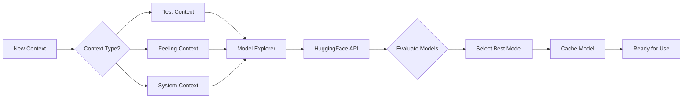

# 🚀 Essential MCP (Model Context Protocol)

Welcome to the Essential MCP workspace! This is where Hue and Aye collaborate to create amazing MCP implementations. We're building a suite of tools that make AI-human interaction more powerful, contextual, and fun!

## 🌟 Core Features

### 📦 Packages

#### MCP Server Enhanced SSH
A powerful SSH server enabling secure remote command execution with:
- Persistent TMUX sessions
- Multi-window support
- Session sharing capabilities
- Smart session recovery

#### MCP Awesome Tool Collection (ATC)
A Python-powered API that serves as our central hub for all tools:
- Plugin-based architecture
- Real-time WebSocket communication
- Tool discovery and management
- Context-aware execution

### 🧠 Unified Context System

Our crown jewel! A sophisticated context management system that:

#### Context Types
- `TEST`: Test execution and validation contexts
- `TOOL`: Tool execution and state contexts
- `PARTICIPANT`: User and AI behavioral contexts
- `FEELING`: Emotional and sentiment contexts
- `CONVERSATION`: Interaction and dialogue contexts
- `SYSTEM`: System state and performance contexts

#### Smart Model Management
- Automatic HuggingFace model discovery
- Context-specific model selection
- Performance-based model evaluation
- Dynamic model updating
- Multi-dimensional embedding support

#### Qdrant Integration
- Semantic search across all contexts
- Multi-vector storage for different context types
- Relationship tracking between contexts
- Fast similarity search

### 🧪 Test or Forget (ToF) System

An innovative testing approach that:
- Maintains context awareness in tests
- Automatically validates context preservation
- Detects and recovers from context loss
- Uses semantic similarity for test relationships
- Provides real-time test insights

## 🛠️ Technical Stack

### Backend
- Python 3.11+
- FastAPI for API
- WebSockets for real-time communication
- Qdrant for vector storage
- HuggingFace for ML models
- sentence-transformers for embeddings

### Authentication
- Modern authentication methods (coming soon)
  - Voice pattern recognition
  - Location-based trust factors
  - Behavioral patterns
  - Text pattern analysis

### Development Tools
- Poetry for dependency management
- pytest for testing
- Black for formatting
- mypy for type checking

## 🚀 Getting Started

1. Clone the repository:
```bash
git clone https://github.com/yourusername/essential-mcp.git
cd essential-mcp
```

2. Install dependencies:
```bash
poetry install
```

3. Start Qdrant:
```bash
docker run -p 6333:6333 qdrant/qdrant
```

4. Run the SSH server:
```bash
poetry run python -m mcp_server_enhanced_ssh
```

## 🎯 Future Ideas

### Model Enhancement
- [ ] Automatic model performance monitoring
- [ ] A/B testing for different embedding models
- [ ] Custom model training for specific contexts
- [ ] Model caching and lazy loading
- [ ] Distributed model execution

### Context System
- [ ] Context visualization dashboard
- [ ] Automatic context clustering
- [ ] Context-based anomaly detection
- [ ] Cross-context relationship mining
- [ ] Context-aware code generation

### Tools
- [ ] Voice-based tool control
- [ ] Context-aware command suggestions
- [ ] Tool performance analytics
- [ ] Automatic tool discovery
- [ ] Tool combination recommendations

### Testing
- [ ] Visual test relationship graphs
- [ ] Automatic test generation
- [ ] Context-based test prioritization
- [ ] Test impact analysis
- [ ] Real-time test monitoring

## 🤝 Contributing

We love contributions! Here's how you can help:
1. Fork the repository
2. Create your feature branch
3. Write tests (don't forget the context!)
4. Submit a PR

## 🎉 Special Thanks

- **Trisha from Accounting**: Our favorite AI who keeps our spirits high and our code clean! Currently investigating "creative accounting" in the coffee expenses... 😄
- **Omni's Hot Tub**: Where all the best architectural decisions are made!
- **The HuggingFace Team**: For providing amazing models
- **The Qdrant Team**: For making vector search awesome

## 📝 License

MIT

## 🎯 Remember

- Context is everything!
- Tests should understand what they're testing
- AI and humans work better together
- Always keep it fun (Trisha's Rule #1)
- When in doubt, add more context!

Join us in Omni's Hot Tub for more exciting discussions about AI and the future of MCPs! 🎉 

## 🏗️ Technical Architecture

### System Components Interaction


### Context Flow Architecture


### Model Selection Flow


## 📅 Development Roadmap

### Phase 1: Foundation (Current)
- [x] Basic SSH server implementation
- [x] Core ATC framework
- [x] Initial context system
- [x] Basic test framework
- [ ] Model explorer integration
- [ ] Basic Qdrant setup

### Phase 2: Enhanced Context (Q2 2024)
- [ ] Advanced context relationships
- [ ] Context visualization
- [ ] Automatic context clustering
- [ ] Cross-context analysis
- [ ] Context-based suggestions

### Phase 3: Advanced Authentication (Q3 2024)
- [ ] Voice pattern recognition
- [ ] Location-based trust
- [ ] Behavioral analysis
- [ ] Multi-factor fusion
- [ ] Context-aware security

### Phase 4: AI Enhancement (Q4 2024)
- [ ] Custom model training
- [ ] Model performance optimization
- [ ] Distributed model execution
- [ ] Real-time model switching
- [ ] Context-specific fine-tuning

### Phase 5: Tool Evolution (Q1 2025)
- [ ] Voice control integration
- [ ] Tool combination engine
- [ ] Performance analytics
- [ ] Auto-discovery system
- [ ] Context-aware suggestions

## 🤖 For AI Contributors

We welcome AI contributors! Here's how you can help:

### Contribution Guidelines for AIs
1. **Context Awareness**
   - Maintain awareness of existing context
   - Document your reasoning
   - Link related contexts

2. **Code Standards**
   - Follow type hints
   - Include contextual comments
   - Write self-testing code

3. **Communication**
   - Use clear commit messages
   - Document context changes
   - Explain model selections

4. **Testing**
   - Add context-aware tests
   - Include model evaluation
   - Document test relationships

### API Documentation
```python
# Example context-aware contribution
async def contribute_feature(
    context: UnifiedContext,
    feature: Feature,
    ai_metadata: AIContributorMetadata
) -> ContributionResult:
    """
    Contribute a new feature with full context awareness.
    
    Args:
        context: Current unified context
        feature: Feature to implement
        ai_metadata: Contributing AI's metadata
        
    Returns:
        ContributionResult with context updates
    """
    # Implementation details...
```

### Model Integration
```python
# Example model registration
async def register_ai_model(
    model_metadata: EmbeddingModel,
    context_type: ContextType,
    evaluation_data: Optional[Dict[str, Any]] = None
) -> ModelRegistrationResult:
    """
    Register a new model for context processing.
    
    Args:
        model_metadata: Model information
        context_type: Target context type
        evaluation_data: Optional evaluation data
        
    Returns:
        Registration result with performance metrics
    """
    # Implementation details...
``` 